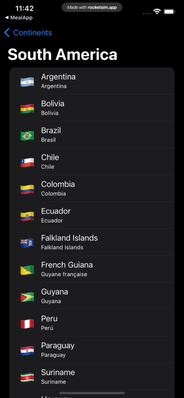

# CountriesQL

Simple iOS app using [Countries GraphQL API](https://github.com/trevorblades/countries).

## Frameworks
* [Apollo iOS](https://github.com/apollographql/apollo-ios)
* [SnapKit](https://github.com/SnapKit/SnapKit)

## Demonstration

